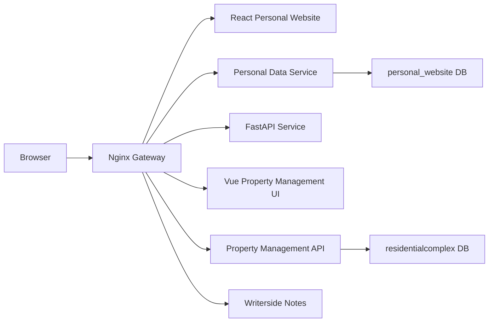

# Yuwen Personal Website

<p align="center">
  <strong>A Dockerized personal website stack for Yuwen Lu</strong>
</p>

<p align="center">
  <a href="https://www.meetyuwen.com/">Live Site</a>
  ·
  <a href="./README-docker.md">Docker Notes</a>
  ·
  <a href="./Yuwen-Personal-Website-main">React Frontend</a>
</p>

<p align="center">
  
  
  
  
  
</p>

## Overview

This repository contains the production stack behind
[meetyuwen.com](https://www.meetyuwen.com/). It brings together a React
portfolio site, backend data services, a FastAPI service, a Vue property
management project, and a Writerside notes site behind one Docker Compose
deployment.

**Author and maintainer:** Yuwen Lu

## What Is Included

| Area | Path | Purpose |
|---|---|---|
| React portfolio | `Yuwen-Personal-Website-main/` | Main personal website, projects, notes, API docs, and system information |
| Personal data service | `Personal-Data-Service-master/` | Spring Boot API for notes, VM status, exchange rates, and site data |
| FastAPI service | `fastapi-service/` | Python API service for ML/quantum model endpoints |
| Gateway | `nginx/` | Unified reverse proxy for all services |
| Property management UI | `propertymanagement-graduationproject-master/` | Vue frontend for the residential complex management project |
| Property management API | `propertymanagement-graduationproject-server-master/` | Backend service for the property management project |
| Learning notes | `LearningJourneyHub-master/` | Writerside documentation and learning notes |

## Architecture



## Local Run

Create a local environment file from the example:

```bash
cp .env.example .env
```

Build and start the default stack:

```bash
docker compose up -d --build
```

Open:

```text
http://localhost/
```

Start the optional Writerside notes service:

```bash
docker compose --profile docs up -d learning-journey-hub
```

## Service Routes

| Route | Service |
|---|---|
| `/` | React personal website |
| `/springapp/` | Personal data Spring Boot API |
| `/api/` | FastAPI service |
| `/residentialcomplex/` | Vue property management frontend |
| `/complex/` | Property management backend API |
| `/notes/` | Writerside notes site, optional profile |

## Useful Commands

```bash
docker compose ps
docker compose logs -f gateway
docker compose up -d --build react-frontend
docker compose up -d --build personal-data-service
docker compose restart gateway
docker compose down
```

## Recent Improvements

- Consolidated the website and related services into a Docker Compose stack.
- Added an nginx gateway with stable local and production routes.
- Updated the website architecture diagram layout.
- Updated the VM performance chart to use dynamic memory percentage data from
  the backend instead of a hardcoded memory size.
- Added environment and deployment documentation for local and server use.

## Author

Built and maintained by **Yuwen Lu**.

